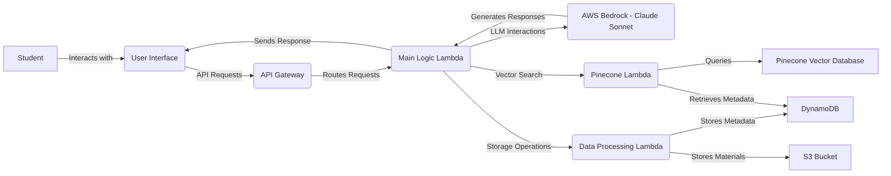

# Multi-Lang-Teacher: Your Private AI Language Tutor

[](https://opensource.org/licenses/MIT)


## Overview

Multi-Lang-Teacher is an AI-powered private teacher agent designed to help students from mainland China learn English and Japanese effectively. Built using powerful Large Language Models (LLMs) through AWS Bedrock and leveraging Pinecone's semantic search capabilities, this agent provides personalized learning support tailored to the unique linguistic background of Chinese learners.

## User Stories

The Multi-Lang-Teacher addresses these key user stories:

### For English Learners
- Ask grammar questions in English and receive clear explanations in English or Simple Chinese
- Get pinyin pronunciation help for English words
- Request example sentences using specific vocabulary
- Receive feedback on written assignments
- Practice vocabulary through interactive quizzes

### For Japanese Learners
- Ask grammar questions in Japanese and receive explanations in Japanese or Simple Chinese
- Get guidance on pronunciation with Chinese phonetic approximations
- Request example sentences with proper kanji usage
- Receive feedback on Japanese writing
- Practice vocabulary and kanji through interactive exercises

### For Teachers (System Administrators)
- Upload and manage learning materials for both languages
- Define grading rubrics for assignments
- Monitor student usage and progress
- Configure system preferences and update knowledge bases

## Core Features

* **Multilingual Teaching Support:**
  * Clear explanations in English, Japanese, and Simple Chinese
  * Pinyin for English words and phonetic approximations for Japanese
  * Contextual examples tailored to the student's learning level

* **Intelligent Language Processing:**
  * Powered by AWS Bedrock's Claude Sonnet LLM
  * Dynamic context enhancement with Pinecone vector search
  * Personalized responses based on learning history

* **Practical Learning Tools:**
  * Instant feedback on writing and grammar
  * Interactive vocabulary and grammar practice
  * Personalized resource recommendations

* **Flexible Learning Experience:**
  * User preference for explanation language
  * Seamless switching between English and Japanese learning
  * Support for different learning styles and levels

## Architecture

The Multi-Lang-Teacher uses a serverless cloud architecture on AWS:



### Component Details

- **API Gateway**: Secure HTTPS endpoint for all client interactions
- **Lambda Functions**:
  - **Main Logic**: Orchestrates request handling and response generation
  - **Pinecone Interaction**: Manages vector embeddings and semantic search
  - **Data Processing**: Handles storage and retrieval of learning materials
- **AWS Bedrock**: Provides Claude Sonnet LLM capabilities
- **Pinecone**: Vector database for semantic search of learning materials
- **DynamoDB**: Fast, scalable NoSQL database for metadata
- **S3**: Object storage for learning materials and resources

## Deployment Guide

### Prerequisites

- AWS Account with appropriate permissions
- AWS CLI installed and configured
- Node.js v14 or later
- Pinecone account (for vector database)

### Step 1: Clone and Set Up

```bash
# Clone the repository
git clone https://github.com/your-username/Multi-Lang-Teacher.git
cd Multi-Lang-Teacher

# Install dependencies for infrastructure
cd infrastructure
npm install
```

### Step 2: Configure AWS Environment

```bash
# Set AWS account and region for deployment
export CDK_DEPLOY_ACCOUNT=your-account-id
export CDK_DEPLOY_REGION=your-region  # e.g., us-east-1
```

### Step 3: Deploy the Infrastructure

```bash
# Bootstrap CDK (first-time only for this account/region)
npx aws-cdk bootstrap aws://${CDK_DEPLOY_ACCOUNT}/${CDK_DEPLOY_REGION}

# Deploy all resources
npx aws-cdk deploy --all --require-approval never
```

### Step 4: Post-Deployment Configuration

1. Create a Pinecone account at [Pinecone.io](https://www.pinecone.io/)
2. Create a Pinecone index with the following settings:
   - Name: `multi-lang-teacher`
   - Dimensions: 1536 (matches the embedding model)
   - Metric: cosine
3. Get your Pinecone API key from the dashboard
4. Update the AWS Secrets Manager secret:
   - Navigate to AWS Secrets Manager in the console
   - Find the secret named `MultiLangTeacher/PineconeApiKey`
   - Update its value with your Pinecone API key in JSON format: `{"pineconeApiKey": "your-api-key-here"}`

## Usage Guide

Once deployed, the Multi-Lang-Teacher exposes several API endpoints:

### API Endpoints

- **POST /** or **POST /query**: Submit a query to the language tutor
- **POST /feedback**: Submit feedback about a previous response

### Example Query

```json
{
  "query": "Can you explain the difference between 'affect' and 'effect'?",
  "language": "english",
  "explanation_language": "chinese"
}
```

### Example Response

```json
{
  "response": "这两个词在英语中经常被混淆：\n\n'Affect' (动词)：表示影响或改变某事物\n例句：The weather affects my mood. (天气影响我的心情。)\n\n'Effect' (名词)：表示结果或影响\n例句：The effect of the medicine was immediate. (药的效果是立竿见影的。)\n\n记忆技巧：A for Action (affect是动作/动词), E for End result (effect是结果/名词)",
  "language": "english",
  "explanation_language": "chinese"
}
```

### Uploading Learning Materials

To enhance the AI's knowledge base with your own materials:

```json
{
  "action": "upload",
  "content": "Grammar rule: In Japanese, the particle は (wa) marks the topic of the sentence, while が (ga) marks the subject...",
  "fileName": "japanese-particles.txt",
  "language": "japanese",
  "type": "grammar",
  "description": "Explanation of basic Japanese particles"
}
```

## Project Structure

- `infrastructure/` - AWS CDK infrastructure code
- `lambda/` - AWS Lambda functions:
  - `main-logic/` - Main request handling
  - `pinecone-interaction/` - Vector database operations
  - `data-processing/` - Learning materials management
- Documentation:
  - `general-architecture.md` - System architecture details
  - `main-workflow.md` - Core user interaction flows
  - `user-story.md` - Detailed user stories
  - `acceptance-criteria.md` - Implementation requirements
  - `inspiration.md` - Project background

## Contributing

Contributions to the Multi-Lang-Teacher project are welcome! Please ensure you follow the architecture and design principles outlined in the documentation.

## License

This project is licensed under the MIT License - see the LICENSE file for details.

---

**Note:** This is a serverless application that requires AWS and Pinecone accounts to deploy and operate. Usage of these services may incur costs according to their pricing models.
